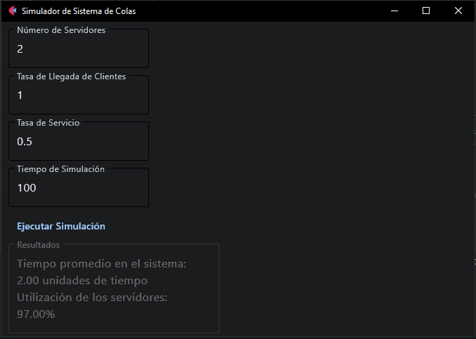

# Simulador de Sistema de Colas

Este proyecto implementa un simulador de sistema de colas con múltiples servidores utilizando Python, Flet y SimPy. El simulador permite configurar el número de servidores, la tasa de llegada de clientes, la tasa de servicio, y simular cómo estos factores afectan el tiempo promedio en el sistema y la utilización de los servidores.

## Herramientas Utilizadas

- **Python**: Lenguaje de programación principal.
- **Flet**: Utilizado para crear la interfaz de usuario.
- **SimPy**: Biblioteca de simulación de procesos para manejar la lógica de la simulación de eventos discretos.

## Cómo Ejecutar el Proyecto

Para ejecutar este proyecto, sigue estos pasos:

1. Clona el repositorio:
2. Cambia al directorio del proyecto:
4. Ejecuta el programa:

## Manual de Uso

### Variables de Entrada

- **Número de Servidores (unidades)**: Define cuántos servidores están disponibles en el sistema para atender a los clientes.
- **Tasa de Llegada de Clientes (clientes por unidad de tiempo)**: Configura la frecuencia con la que los clientes llegan al sistema.
- **Tasa de Servicio (clientes atendidos por unidad de tiempo y servidor)**: Establece la velocidad con la que cada servidor puede atender a los clientes.
- **Tiempo de Simulación (unidades de tiempo)**: Determina cuánto tiempo durará la simulación.

### Botón de Ejecución

Al hacer clic en este botón, la simulación se ejecuta con los parámetros especificados y los resultados se mostrarán en el área de resultados.

### Área de Resultados

Muestra el tiempo promedio que un cliente pasa en el sistema y la utilización de los servidores después de completar la simulación.

## Captura de la Interfaz

## Licencia

Este proyecto está licenciado bajo la Licencia MIT - vea el archivo [LICENSE](LICENSE) para más detalles.

